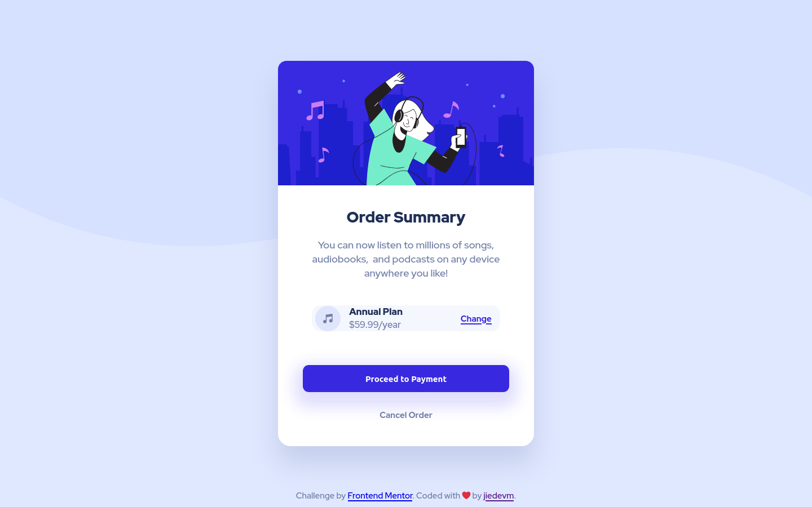

# Frontend Mentor - Order summary card solution

This is a solution to the [Order summary card challenge on Frontend Mentor](https://www.frontendmentor.io/challenges/order-summary-component-QlPmajDUj). Frontend Mentor challenges help you improve your coding skills by building realistic projects. 

## Table of contents

- [Overview](#overview)
  - [The challenge](#the-challenge)
  - [Screenshot](#screenshot)
  - [Links](#links)
- [My process](#my-process)
  - [Built with](#built-with)
  - [What I learned](#what-i-learned)
  - [Continued development](#continued-development)
  - [Useful resources](#useful-resources)
- [Author](#author)

## Overview

### The challenge

Users should be able to:

- See hover states for interactive elements

### Screenshot



### Links

- Solution URL: [Add solution URL here](https://your-solution-url.com)
- Live Site URL: [Add live site URL here](https://your-live-site-url.com)

## My Process

### Built with

- Semantic HTML5 markup
- CSS custom properties
- Flexbox
- CSS Grid

### What I learned

With this demo project I learned :

- How to use css **flexbox** and **grid** properties when positioning elements.
- How to take advantage of pseudo attributes like **::before**

```css
/* index.css */
body::before {
  content: '';
  display: block;
  position: absolute;
  top: 0;
  width: 100%;
  height: 100%;
  background-size: contain;
  background-repeat: no-repeat;
  z-index: -2;
  background-image: url("../images/pattern-background-desktop.svg");
}
```

### Useful resources

- [Flexbox Froggy](https://flexboxfroggy.com/) - A learning game. It helped me to understand how to use the **css flexbox** properties.
- [Kevin-Pwell - Are you using the right CSS units?](https://www.youtube.com/watch?v=N5wpD9Ov_To) - This tutorial helped me to understand **css units**.
- [Kevin-Pwell - CSS em and rem explained](https://www.youtube.com/watch?v=_-aDOAMmDHI&list=RDCMUCJZv4d5rbIKd4QHMPkcABCw&index=1) - This is a very good tutorial about css units **rem and em**. It helped me to create responsive views easier.


## Author

- Github - [dieudonneallognon](https://github.com/dieudonneallognon)
- Frontend Mentor - [@dieudonneallognon](https://www.frontendmentor.io/profile/dieudonneallognon)
